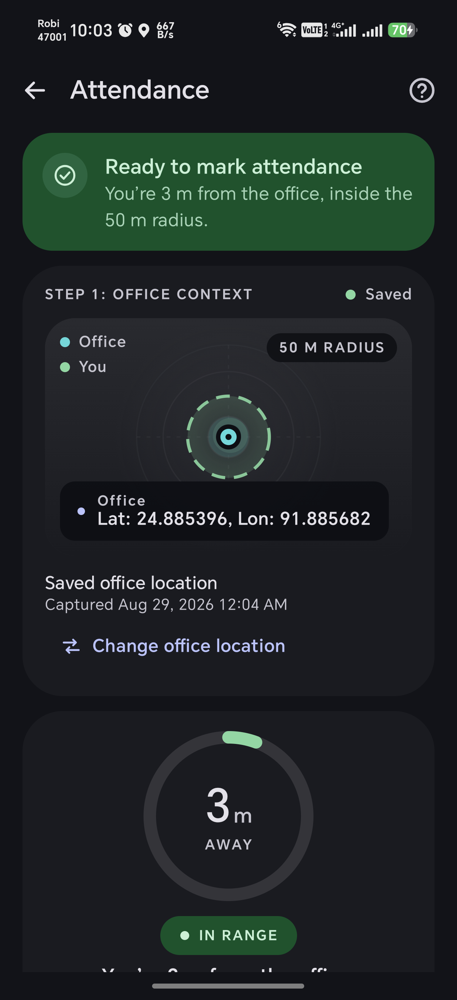

# PresenceLens

This repository contains the complete submission for the Intelligent Machines technical assessment, consisting of two mobile applications.

| Task | Stack | Purpose | Verification | APK |
| --- | --- | --- | --- | --- |
| **Task 1** | Native Android / Kotlin | Geo-fenced Attendance | 158 Tests, Emulator | [Download (v1.0.0)](https://github.com/rktuhinbd/PresenceLens/releases/download/v1.0.0/PresenceLens-Attendance-v1.0.0.apk) |
| **Task 2** | Flutter / Dart | Advanced Camera & Resilient Sync | 521 Tests, Physical Device | [Download (v1.0.0)](https://github.com/rktuhinbd/PresenceLens/releases/download/v1.0.0/PresenceLens-Capture-v1.0.0.apk) |

## Why this submission stands out

- **Offline-first durability**: Both apps prioritize resilience in low/no-connectivity environments.
- **Transaction-safe batching**: Camera captures are committed atomically; partial failures never corrupt the batch.
- **Atomic upload claims**: SQLite locking guarantees a single background worker drains the queue without duplication.
- **Camera lifecycle race protection**: Handled via asynchronous initialization guards and strict domain states.
- **Truthful camera capability handling**: Zoom presets and focus points are derived from actual reported hardware values, not static assumptions.
- **Physical-device QA**: Executed against actual Samsung and HONOR hardware.
- **Automated Verification**: Over 670 automated tests run cleanly with no lint warnings or skipped checks.
- **Requirement traceability**: Every feature traces directly to an explicit assessment requirement.
- **Transparent Generative AI usage**: Documented prompts and outcomes for architecture, test planning, and edge-case discovery.

## Repository structure

```
PresenceLens/
├── android-attendance/     # Task 1: Native Android Geo-fenced app
├── flutter_camera_sync/    # Task 2: Flutter Camera & Resilient Sync app
└── docs/                   # Architectural decisions, matrices, and planning
```

## Architecture at a glance

Both apps employ strict layered architectures separating UI presentation from domain policies and data layers:
- **Native Android**: Clean MVVM, Kotlin Flow, and DataStore. Business rules (e.g. 50m boundaries) are isolated from Android imports.
- **Flutter**: BLoC and Cubit. `CameraCubit` orchestrates discovery and optics without persistence knowledge. `SyncBloc` projects a durable SQLite background queue into the UI state.

## Screenshots

### Native Android Attendance


### Flutter Camera & Sync


## Quick start

### Native Android
```bash
git clone https://github.com/rktuhinbd/PresenceLens.git
cd PresenceLens/android-attendance
./gradlew installDebug
```

### Flutter
```bash
cd PresenceLens/flutter_camera_sync
flutter pub get
flutter run
```

## Releases

Final installable release-mode APKs are available on the [Releases](https://github.com/rktuhinbd/PresenceLens/releases/tag/v1.0.0) page.

- [PresenceLens-Attendance-v1.0.0.apk](https://github.com/rktuhinbd/PresenceLens/releases/download/v1.0.0/PresenceLens-Attendance-v1.0.0.apk) (Task 1)
- [PresenceLens-Capture-v1.0.0.apk](https://github.com/rktuhinbd/PresenceLens/releases/download/v1.0.0/PresenceLens-Capture-v1.0.0.apk) (Task 2)

## Verification

### Automated Gates
- Native Android: `158` automated tests + emulator acceptance evidence.
- Flutter: `521` passing tests, `flutter analyze` 0 issues.

### Device QA
Flutter physical QA:
- **HONOR DNP-NX9 / Android 16** — extensive runtime QA
- **Samsung Galaxy S25** — physical pinch-to-zoom acceptance after optimization

Native Android:
- **Emulator** — automated + emulator acceptance evidence

## Generative AI usage

Generative AI was utilized to analyze edge-cases, design SQLite locking strategies, and plan resilient test cases. Full transparency, including real prompt logs, is documented in the [AI Usage Disclosure](docs/AI_USAGE.md).

## Assessment documentation

- [Submission Summary](SUBMISSION.md)
- [Flutter Details](flutter_camera_sync/README.md)
- [Native Android Details](android-attendance/README.md)
- [Requirements Matrix](docs/REQUIREMENTS_MATRIX.md)
- [Architecture & Decisions](docs/DECISIONS.md)
