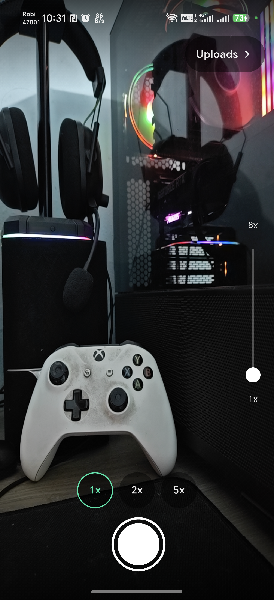
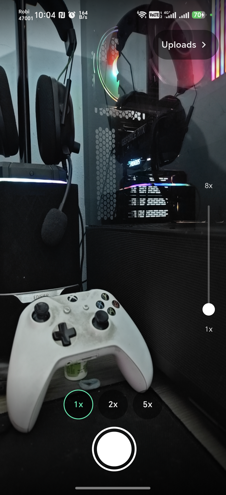
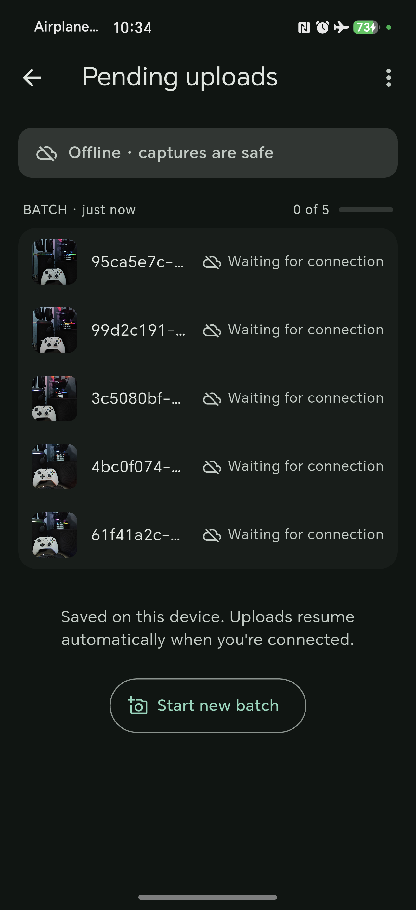
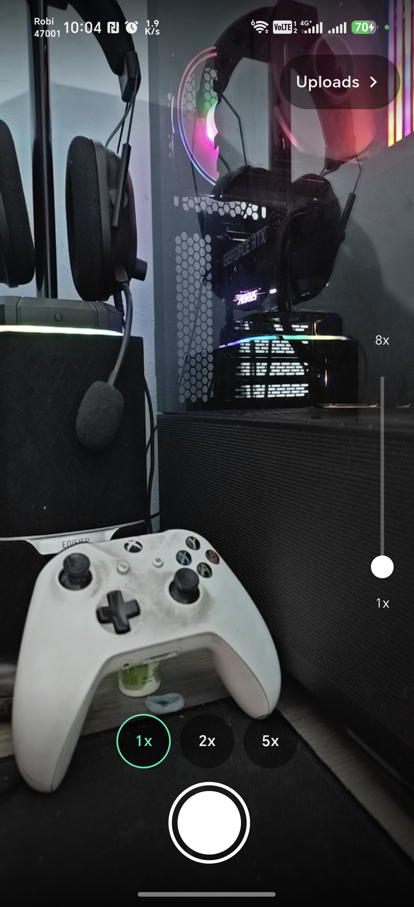
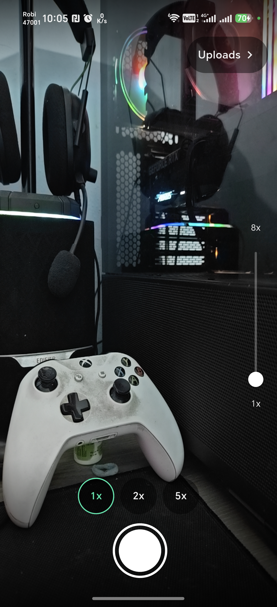

# PresenceLens Capture — Advanced Camera & Resilient Sync

This application is the Flutter submission for Task 2 of the PresenceLens technical assessment. It delivers a resilient, offline-first mobile capture experience with a highly responsive custom camera and background sync engine.

## What it demonstrates

- **Custom Camera Implementation**: Uses Flutter's camera package with the Android CameraX implementation behind a narrow CameraEngine/CameraSession adapter.
- **Resilient Background Sync**: Durable SQLite queue paired with WorkManager to ensure no data is lost.
- **Physical Capabilities**: Genuine pinch-to-zoom and tap-to-focus tied to actual device capabilities, not assumed constants.
- **Truthful UI**: Only representing camera configurations and zoom ranges strictly reported by the hardware.

## Architecture

The application is built on a layered architecture:

**Presentation → Application/Domain ← Data/Platform**

- **Presentation**: Flutter widgets completely decoupled from business rules.
- **Domain**: Pure Dart policies ensuring that logic like zoom bounds and focus mapping are decoupled from the platform.
- **Data/Platform**: Platform channels, CameraX plugins, SQLite DAOs, and the WorkManager isolate.

## State management

The application utilizes the BLoC pattern for rigorous state isolation. 
- **CameraCubit**: Orchestrates camera discovery, lifecycle, switching, focus, zoom, and capture without embedding any persistence logic.
- **SyncBloc**: Projects durable queue state, connectivity, and lifecycle reconciliation into upload presentation state, while the SQLite and worker layers retain absolute transactional correctness.

## Camera engine

- **Live Preview**: Custom viewport mapping without letterboxing issues.
- **Truthful Rear-Camera Discovery**: Prevents invalid optical claims.
- **Actual Min/Max Zoom**: Extracted directly from the platform.
- **Pinch + Slider**: Unified zoom input mapped to a single source of truth.
- **Tap Focus**: Capability-aware exposure and focus region mapping.
- **Lifecycle/Race Protection**: Asynchronous initialization guards and capture concurrency guard to prevent state races.

## Offline-first flow

1. **Capture** → the image is written to a durable, app-owned file.
2. **SQLite metadata** → a row describing that file is inserted.
3. **Finish batch** → one transaction marks the batch `QUEUED` and its images `PENDING`.
4. **WorkManager** → a constrained background drain is scheduled.
5. **Atomic SQL claim** → the worker claims one eligible image and moves it to `UPLOADING`.
6. **Deterministic mock API** → the upload is attempted.
7. **Terminal state** → `UPLOADED` on success, or back to `PENDING` for a later retry.

Nothing is deleted on failure. An image that cannot be sent stays on the device, in its
own file, until it has been uploaded.

## Background sync

Connectivity is advisory only — the API result is authoritative, and the app never treats
"the OS says we are online" as proof that an upload will succeed.

WorkManager schedules constrained background drains; connectivity regain and lifecycle
reconciliation opportunistically schedule further work. The OS decides exactly when a
worker runs, which keeps the drain battery-efficient and resilient across process death.

## Persistence

All data is stored in app-owned file directories combined with structured SQLite metadata. Image data is strictly kept out of BLOB storage to ensure optimal database performance.

## Build/run

To build and run the application on a connected device or emulator:

```bash
flutter pub get
flutter run
```

## Tests

The codebase enforces strict quality gates, verified by **521 automated tests** covering widget rendering, BLoC state transitions, SQLite integration, and the headless worker isolate.

## Device QA

- **HONOR DNP-NX9 (Android 16)**: Passed physical verification for live preview, zoom slider/presets, tap focus, capture, rapid shutter guard, multiple capture batches, offline batch finishing, durable pending uploads, background automatic upload, lifecycle recovery, and permission recovery.
- **Samsung Galaxy S25**: Physical pinch-to-zoom acceptance user-confirmed.

## Screenshots

Unmodified captures from a physical HONOR DNP-NX9 (Android 16), taken from the published
v1.0.0 APK.

| Camera ready | Focus + zoom | Offline queue |
| --- | --- | --- |
|  |  |  |
| Live preview with capability-derived zoom presets and slider. | Focus reticle at the tap point, held at 2x zoom. | Batch finished offline — five images waiting, retained on device. |

| Active batch | Synced |
| --- | --- |
|  |  |
| A live draft batch of three captures, with thumbnail and count. | The same five images after connectivity returned — drained automatically, no manual retry. |

## Release APK

The release-mode Android APK can be downloaded here:

https://github.com/rktuhinbd/PresenceLens/releases/download/v1.0.0/PresenceLens-Capture-v1.0.0.apk

## Generative AI Usage

Generative AI was used transparently to assist with requirements extraction, test planning, SQLite edge-case analysis, and architectural review. See the root [AI_USAGE.md](../docs/AI_USAGE.md) for full disclosure and examples.

## Platform notes

iOS project sources are retained for Flutter source compatibility. Physical iOS validation
and signed IPA packaging were not performed because this assessment was built and validated
from Windows; the requested release deliverable is the Android APK.

HONOR devices impose an OEM-specific background restriction (`HN_USER_EXPERIENCE`) that suppresses standard WorkManager execution. This is a vendor modification, not an Android or application defect.
